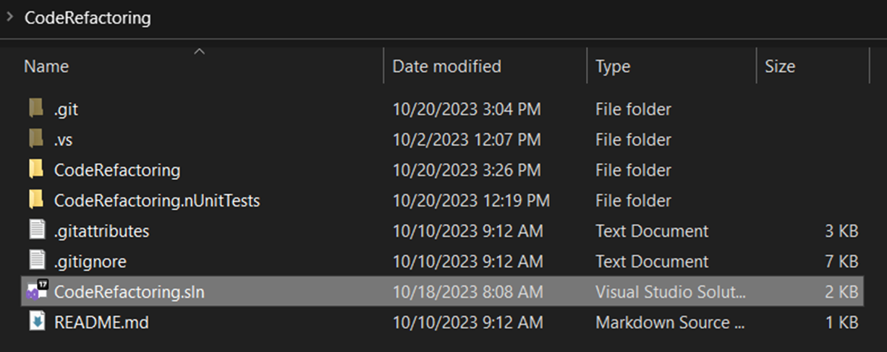
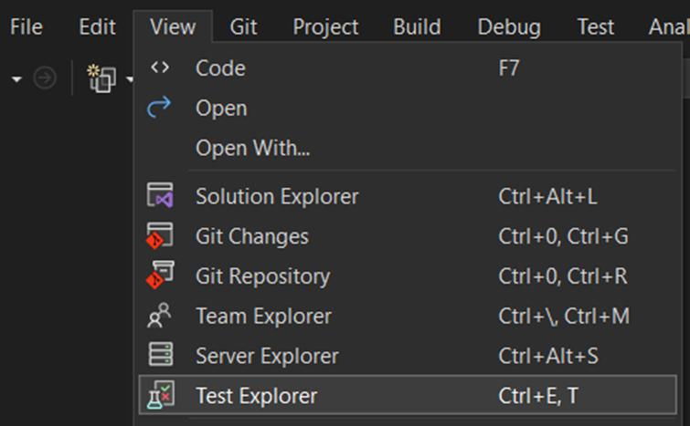
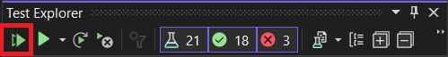
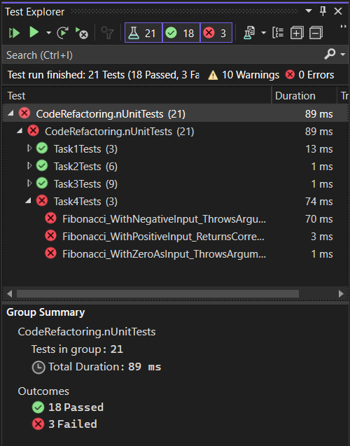

# CodeRefactoring

📦 Repository for practice on refactoring a codebase utilizing best practices and design patterns.

## Description

This project aims to refactor and improve an existing codebase by applying industry best practices and design patterns. The primary goal is to enhance the codebase's readability, maintainability, and extensibility.

## Table of Contents

- [Installation](#installation)
- [Usage](#usage)
- [Tasks Information](#tasks-information)

## Installation

1. Clone the repository:

```bash
git clone https://github.com/EngMohamedRaafat/CodeRefactoring.git
```

2. Navigate to the project directory:

```bash
cd CodeRefactoring
```

3.  Open the project in Visual Studio.
    

4.  You should see 2 projects in the Solution Explorer:

    - CodeRefactoring → (**Practice**)
      - Contains all the tasks that need a code refactoring.
      - Each task exist in a separate .cs file.
    - CodeRefactoring.nUnitTest → (_No Need to Change_)
      - Contains a test file for each task

## Usage

- Make sure that changes passes before making any changes:

  1. Open the **Test Explorer**.
     
  2. Click on **Run All Tests In View**.
     
  3. You should see all tests passes except tests related to **_Task4_** (as it contains some bugs).
     

## Tasks Information

This project contains 4 tasks that need to be refactored:

- [Task 1](#task-1)
  - [Description](#description-1)
  - [Steps Checklist](#steps-checklist)
- [Task 2](#task-2)
  - [Description](#description-2)
  - [Steps Checklist](#steps-checklist-1)
- [Task 3](#task-3)
  - [Description](#description-3)
  - [Steps Checklist](#steps-checklist-2)
- [Task 4](#task-4)
  - [Description](#description-4)
  - [Steps Checklist](#steps-checklist-3)

### Task 1

#### Description

In this example, you have a simple login system that allows a maximum of three login attempts.
If the user enters an incorrect password, they have two remaining attempts before the gets locked.

This task covers:

1. Introduce Explaining Variable
1. Replace With Constant
1. Replace Conditional With Guard Clause

#### Steps Checklist

1. [ ] Create a new branch from the master branch (e.g., **task1-cr**)
1. [ ] Open the task file, apply the applicable code refactoring types.
1. [ ] Run the related test, then commit your changes. (Make sure that test passes)
1. [ ] Merge you changes to the master branch.

### Task 2

#### Description

There are three notification services: EmailService, SmsService, and PushNotificationService.
Each service has a method to send notifications to users through different channels - email, SMS, and push notifications, respectively.

This task covers:

1. Extract Interface

#### Steps Checklist

1. [ ] Create a new branch from the master branch (e.g., **task2-cr**)
1. [ ] Open the task file, apply the applicable code refactoring types.
1. [ ] Run the related test, then commit your changes. (Make sure that test passes)
1. [ ] Merge you changes to the master branch.

### Task 3

#### Description

In this task, Let's imagine we have two systems one for managing an online bookstore and the other for a library. We currently have a single class called Book that handles all the functionality related to books. However, it's better to separate concerns and create separate classes for different responsibilities. The task includes extracting classes to handle specific responsibilities, such as managing books in the bookstore and managing books in the library.

This task covers:

1. Extract Class
1. Extract Super Class
1. Extract Methods

#### Steps Checklist

1. [ ] Create a new branch from the master branch (e.g., **task3-cr**)
1. [ ] Open the task file, apply the applicable code refactoring types.
1. [ ] Run the related test, then commit your changes. (Make sure that test passes)
1. [ ] Merge you changes to the master branch.

### Task 4

#### Description

In this Task, you have a Fibonacci program with some logical errors.

#### Steps Checklist

1. [ ] Create a new branch from the master branch (e.g., **task4-cr**)
1. [ ] Open the task file, apply the applicable code refactoring types.
1. [ ] Run the related test, then commit your changes. (Make sure that test passes)
1. [ ] Merge you changes to the master branch.
1. [ ] After finishing all the required tasks, Create a GitHub repository.
1. [ ] Push changes on the master branch to the new repository.
